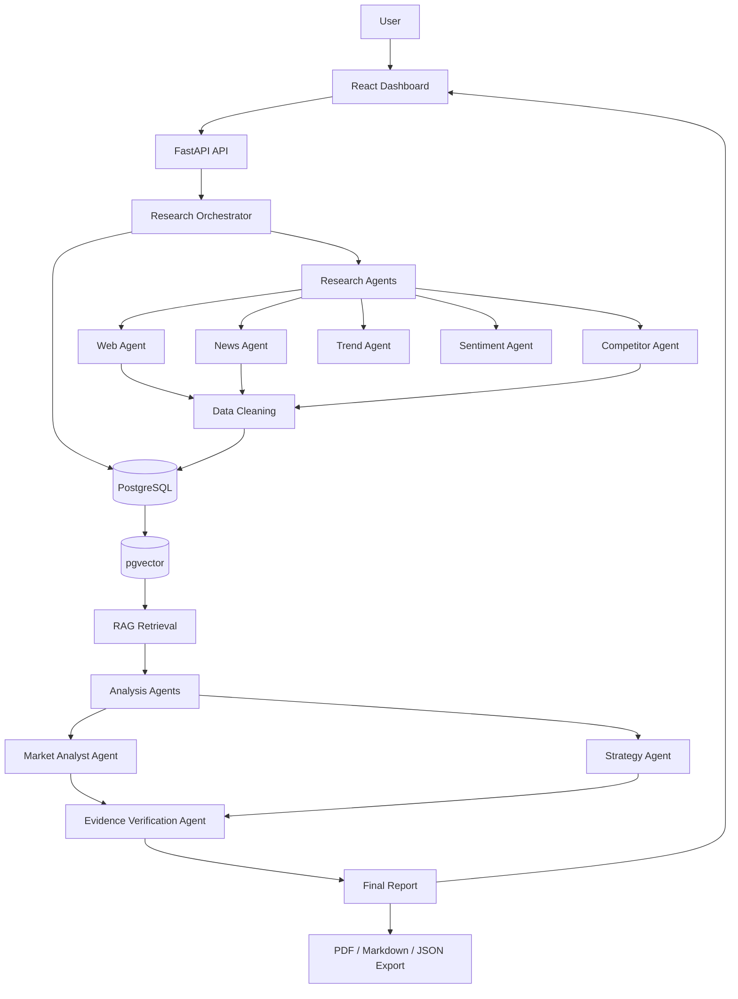
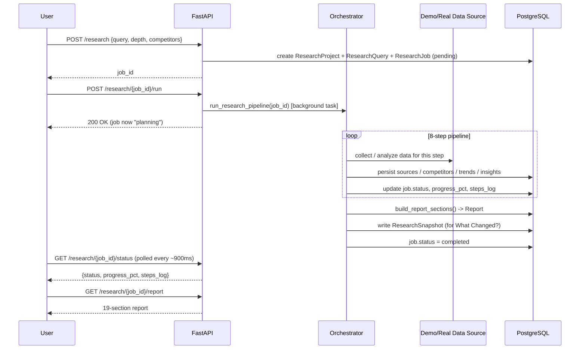
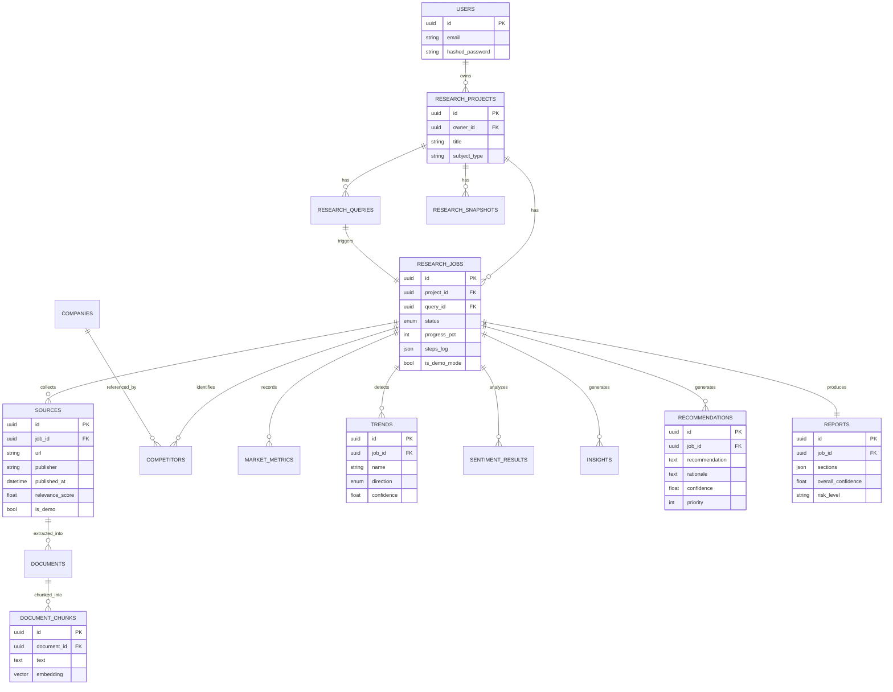
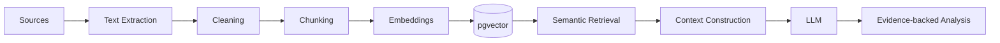

# Architecture

## System overview

## Research pipeline (per job)

## Database schema

## Agent responsibilities

| Agent | Input | Output |
|---|---|---|
| Research Planner | raw query | research plan (question list) |
| Web Research | plan | `Source` rows (web) |
| News Research | plan | `Source` rows (news), prioritized by recency |
| Competitor Intelligence | plan + competitor list | `Competitor` rows (structured comparison) |
| Market Trend | collected sources | `Trend` rows with direction + confidence |
| Sentiment Analysis | collected sources | `SentimentResult` rows (only where data supports it) |
| Market Analyst | RAG-retrieved context | `Insight` rows (fact/inference), market overview |
| Strategy | market analysis | `Recommendation` rows with rationale + risk |
| Evidence / Fact-Check | all of the above | rejects unsupported numeric claims before report assembly |

In this build, `app/services/demo_data.py` produces a deterministic,
clearly-labeled dataset that stands in for the combined output of all nine
agents so the full pipeline (steps, persistence, report assembly, export,
diffing) is exercised end-to-end without requiring paid API keys.
`app/services/orchestrator.py` has one clearly-marked seam
(`generate_demo_dataset(...)` call) where a real LangGraph agent graph would
be substituted once `OPENAI_API_KEY` / `SEARCH_API_KEY` / `NEWS_API_KEY` are
configured.

## RAG pipeline (schema-ready, not yet populated with real embeddings)

The `document_chunks` table (with a 1536-dim `vector` column matching
`text-embedding-3-small`) and the `pgvector` extension are live and verified
in this build's PostgreSQL instance. What's missing is real document text to
chunk and embed -- that arrives once the Web/News agents fetch live pages
instead of demo data.

## Why FastAPI BackgroundTasks instead of Celery (for now)

Celery + Redis are fully configured (`CELERY_BROKER_URL`,
`CELERY_RESULT_BACKEND` in settings, Redis running in docker-compose) but the
orchestrator currently runs as a FastAPI `BackgroundTask`. For a portfolio
demo this is simpler to reason about and debug; swapping in a Celery worker
means moving `run_research_pipeline` into a `@celery_app.task` and calling
`.delay()` from the route instead of `background_tasks.add_task(...)` -- the
orchestrator function itself doesn't need to change.
