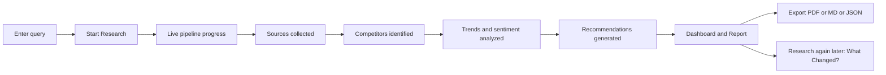

# MarketLens AI

**AI-Powered Market Research & Competitive Intelligence Platform**

Enter a market, a company, or a head-to-head comparison — get back a
structured, evidence-graded market intelligence report: market sizing,
competitor breakdowns, trends, sentiment (where available), a SWOT, and
prioritized strategic recommendations, all traceable back to sources with
explicit confidence scores.

```
"Indian electric vehicle market"  ->  Research Pipeline  ->  19-section report
"Zomato vs Swiggy"                     (plan -> collect ->     + citations
"Global SaaS market"                    process -> analyze ->  + confidence
"Tesla"                                  verify -> report)      + PDF/MD/JSON
```

## Why this exists

Most "AI market research" demos are a chatbot with a system prompt. This is
not that. Every numeric claim is either backed by a stored source or
explicitly marked `"Insufficient reliable data found."` -- the system never
invents a market size or a citation. Claims are tagged as **Fact**,
**Inference**, or **Recommendation** so a reader knows what's observed vs.
what's AI judgment.

## Stack

| Layer | Technology |
|---|---|
| Frontend | React 19 + Vite + TypeScript + Tailwind CSS v4 + Recharts + lucide-react |
| Backend | FastAPI + Pydantic v2 + SQLAlchemy 2.0 (async) |
| Database | PostgreSQL 16 + pgvector |
| AI | OpenAI API (provider-agnostic interface -- Claude/Gemini pluggable) |
| Background jobs | FastAPI BackgroundTasks (Celery + Redis wired and ready to swap in) |
| Auth | JWT (local, self-contained) |
| Export | ReportLab (PDF), Markdown, JSON |
| Testing | Pytest (async, httpx) |
| Deployment | Docker + docker-compose |

See [ARCHITECTURE.md](./ARCHITECTURE.md) for the full pipeline and agent
design, [API.md](./API.md) for endpoint docs, and [SETUP.md](./SETUP.md) for
local development instructions (with and without Docker).

## Quickstart (Docker)

```bash
cp backend/.env.example backend/.env
docker compose up --build
```

- Frontend: http://localhost:5173
- Backend API docs: http://localhost:8000/docs

The app runs in **DEMO_MODE** out of the box -- no API keys required. Every
demo-generated source, metric, and competitor is clearly labeled as
simulated in the UI. To enable live research, add `OPENAI_API_KEY` /
`SEARCH_API_KEY` / `NEWS_API_KEY` to `backend/.env` and set `DEMO_MODE=false`.

For running without Docker (what was actually used to build and verify this
project), see [SETUP.md](./SETUP.md).

## The user journey



## Key features

- **Evidence-first**: every source stored with URL, publisher, publication
  date, retrieval date, and a relevance score; every trend/insight/
  recommendation carries a confidence score and links back to its sources.
- **19-section structured report** -- executive summary through confidence
  assessment -- with missing sections explicitly marked rather than
  fabricated.
- **What Changed?** -- re-run research on the same subject later and see a
  diff: new competitors, changed metrics, new trends, new risks.
- **Demo mode by default** -- the complete pipeline (all 9 conceptual
  agents, RAG-ready schema, evidence verification, report assembly) runs
  end-to-end with zero paid API keys, using a deterministic, clearly-labeled
  synthetic dataset generator.
- **Provider-agnostic AI layer** -- swapping OpenAI for another LLM provider
  touches one service module, not the pipeline.

## Current limitations (see PROGRESS.md for full detail)

- **Real agents ARE implemented** (as of this update): `backend/app/agents/`
  contains a LangGraph pipeline (planner -> web/news research -> competitor
  intelligence -> trends -> sentiment -> market analyst -> strategy ->
  evidence check) backed by Gemini, using Gemini's built-in Google Search
  grounding tool for live web sources -- no separate search API key needed.
  Set `GEMINI_API_KEY` and `DEMO_MODE=false` in `backend/.env` to use it.
  **This was not runnable-tested end-to-end from the build sandbox**: its
  network egress blocks `generativelanguage.googleapis.com` entirely, so
  live Gemini calls could not be exercised there. Run
  `backend/scripts/test_gemini_key.py` first on your own machine to verify
  your key and grounding both work before starting the full app.
- Market size / CAGR figures are intentionally left blank in live mode
  (shows "Insufficient reliable data found.") rather than extracting a
  possibly-wrong number from search snippets -- see the docstring in
  `app/agents/graph.py` for why.
- RAG embeddings: the `pgvector`-backed `document_chunks` table and
  extension are live and tested, but the live agents don't write real
  embeddings yet -- they use Gemini's grounding directly rather than a
  separate chunk-and-embed-and-retrieve step.
- Background jobs currently run via FastAPI `BackgroundTasks` rather than
  Celery workers; Redis is running and wired for that upgrade.
- Per-claim source linkage (`source_ids` on insights/recommendations) isn't
  populated in live mode yet -- the sources themselves are real and stored,
  but insights/recommendations don't yet point back to which specific
  source backs them.
